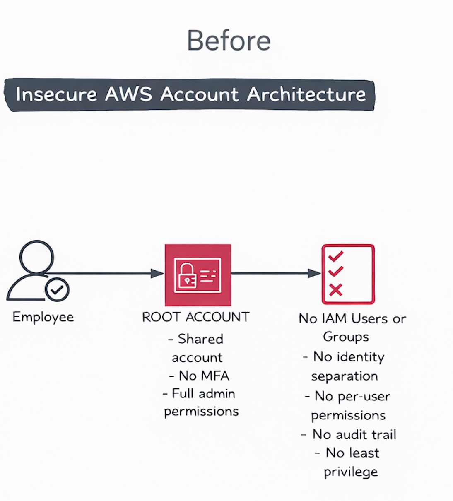
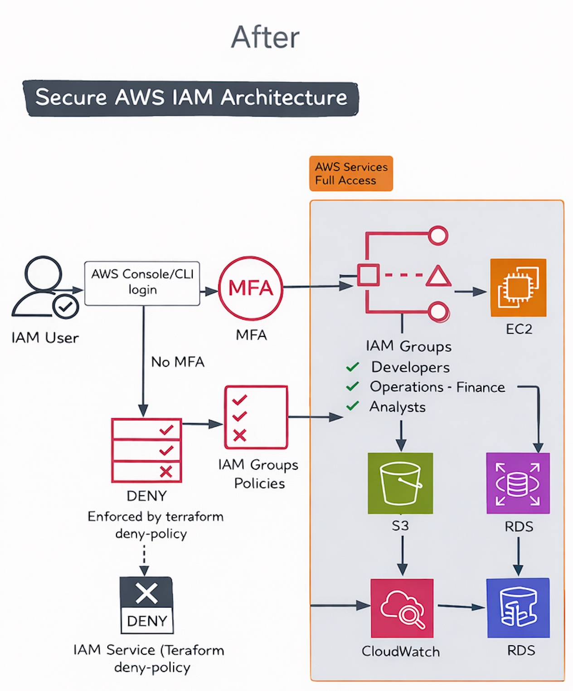

# IAM Security Migration (Terraform)

This project migrates a small startup from **shared, unmanaged access** to a **Terraform-managed IAM model** built around:
- **group-based permissions** (users have no direct permissions)
- **least privilege**
- **MFA enforcement via an explicit Deny guardrail**
- an **account password policy**

> Scope note: This project focuses on **IAM users, groups, and permissions**. Root-account operational practices are intentionally out of scope.

---

## Problem Statement (Before)

A typical early-stage anti-pattern: people move fast and end up with **shared credentials** and **no separation of duties**.  
That creates:
- no accountability (who did what?)
- oversized blast radius (one mistake affects everything)
- privilege escalation pathways (people who can operate infra can also change IAM)

---

## Target State (After)

**Desired outcome:** every person has an identity, and **permissions are assigned by job function**.

**Model:**
- IAM Users: authentication only (console/CLI)
- IAM Groups: authorization via attached policies
- Policies: JSON documents that express *API-level actions* each team may call

**Important clarification (interview trap):**
IAM authorizes **AWS API actions**, not “service usage”.
- ✅ `ec2:StartInstances` (API authorization)
- ❌ SSH into EC2 (network/auth on the instance, not IAM)
- ❌ SQL queries inside MySQL (database permissions, not IAM)

---

## Architecture Diagrams (Before / After)

### Before (Insecure)


### After (Terraform-managed IAM)


> Tip: If you want the diagrams to communicate the *IAM truth* clearly, label the “authorization” box as **AWS API Authorization (Allow / Explicit Deny / Implicit Deny)**.

---

## IAM Design Principles

- **Identity ≠ permissions**: users do nothing by default
- **Separation of duties**: each group only gets what it needs
- **Least privilege over convenience**
- **Explicit Deny used intentionally** (guardrails)
- **Policies describe API actions**, not application-layer permissions

---

## Team Groups and Access

### Developers (`policies/developers.json`)
Goal: application-level operations only.
- EC2 start/stop + read-only describe (no terminate)
- S3 read/write only to the application bucket
- CloudWatch logs read

### Operations (`policies/operations.json`)
Goal: operate infrastructure **without the ability to change IAM or billing**.
- Broad EC2 / RDS / SSM / CloudWatch
- S3 access scoped to app/log/backup buckets
- **Explicit Deny**: IAM, Organizations, Billing (prevents privilege escalation)

### Finance (`policies/finance.json`)
Goal: cost management + visibility.
- Billing console, Cost Explorer, Budgets
- read-only describe/list across common services (visibility without modification)

### Analysts (`policies/analysts.json`)
Goal: data visibility without infrastructure changes.
- S3 read-only to the application bucket
- RDS **metadata** read-only (Describe/List)
- Note: “read-only database queries” are **not IAM**; that’s handled by DB users/roles.

### Admins (optional)
If you include an Admins group, define it explicitly as a **break-glass** or **limited membership** group and justify why it exists.  
Otherwise, remove this concept from the README to avoid confusion.

---

## MFA Enforcement

IAM doesn’t provide a simple “require MFA” switch per user. This project enforces MFA using the standard pattern:
- an **explicit Deny** policy attached to each user
- blocks most actions when `aws:MultiFactorAuthPresent = false`

Policy: `policies/mfa_enforce.json`

**Limitation (be honest):**
MFA enforcement improves interactive access control, but it doesn’t magically fix:
- poor access key hygiene
- compromised credentials already issued
- non-IAM access paths (e.g., DB auth)

---

## Account Password Policy

Implemented via `aws_iam_account_password_policy`:
- minimum length 12
- complexity requirements enabled
- password reuse prevention enabled
- password expiration disabled (decision: reduce forced-rotation risk; revisit per org policy)

---

## Repository Hygiene (Security)

- Terraform state is **not** committed. Ensure `.gitignore` includes:
  - `terraform.tfstate`
  - `terraform.tfstate.backup`
  - `.terraform/`
  - `*.tfstate*`

State should be treated as sensitive and stored in a secure backend in real teams.

---

## Usage

```bash
terraform init
terraform fmt -recursive
terraform validate
terraform plan
terraform apply
```

Cleanup:
```bash
terraform destroy
```

---

## Validation Evidence

Screenshots are in `./screenshots/` and show:
- users, groups, and memberships
- MFA enforcement: denied without MFA, allowed with MFA
- example allow/deny outcomes per team policy
- terraform plan/apply outputs

(See the `screenshots/` directory for full evidence.)

---

## Decisions (short form)

Decision: Group-based permissions only  
Why acceptable: reduces drift and simplifies review  
Trade-off: less flexibility for one-off exceptions  
Revisit if: frequent exceptions become normal (then use roles / permission boundaries)

Decision: MFA enforced via explicit Deny  
Why acceptable: reliable guardrail at the IAM policy layer  
Trade-off: more moving parts; needs careful testing  
Revisit if: organization adopts SSO/Identity Center as primary access

---

## Lessons Learned

- Explicit Deny beats Allow, and is useful for guardrails.
- Separation of duties reduces blast radius and privilege escalation risk.
- IAM controls AWS API access, not application-layer authorization.
- IaC makes IAM reproducible and reviewable (no silent console drift).
